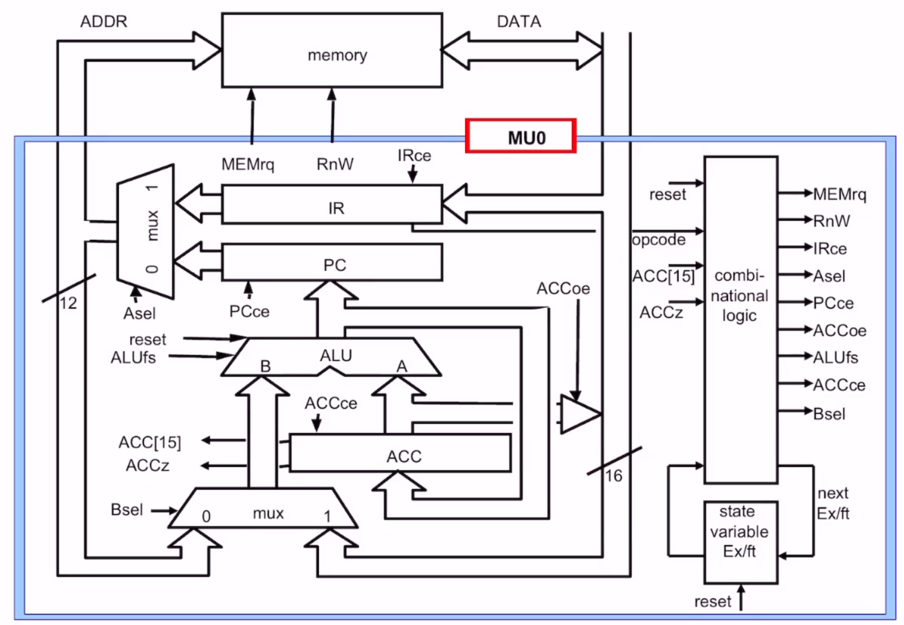
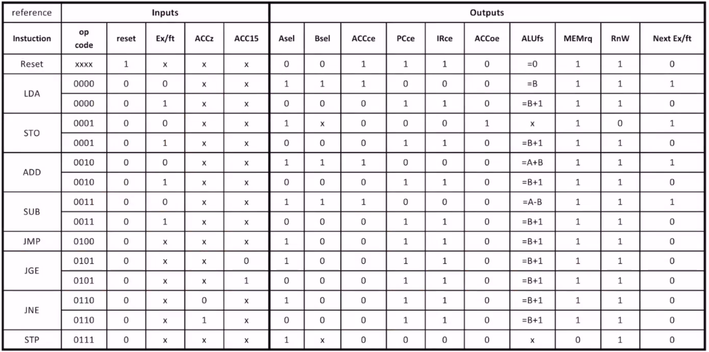
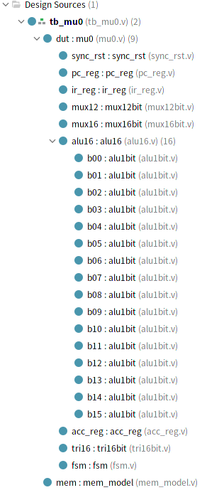
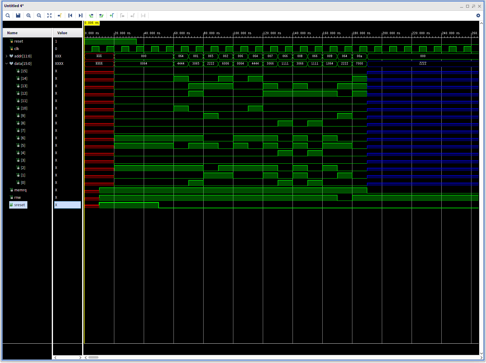

# 16bit processor

## A 16 bit processor
*   16-bit instruction
*   16-bit data
*    12-bit address memory space (8Kbytes)

Instruction format
*   4-bit opcode
*   12-bit operand

|Inst.|Opcode|Effect|
|----|----|----|
|LDA S|0000|ACC := mem[S]|
|STO S|0001|mem[S] := ACC|
|ADD S|0010|ACC := ACC + mem[S]|
|SUB S|0011|ACC := ACC - mem[S]|
|JMP S|0100|PC := S|
|JGE S|0101|if ACC >= 0 PC := S|
|JNE S|0110|if ACC != 0 PC := S|
|STP S|0111|stop|

MU0에서 사용하는 메모리의 read 또는 write 엑세스는 항상 1 cycle이 필요함.
따라서 read, write가 필요한 명령어는 2 cycle이 필요하다.
LDA, STO ,ADD ,SUB 는 2 cycle.
JMP, JGE, JNE, STP은 1 cycle.

## Block diagram of the MU0
*   IR (Instruction register)
*   PC (Program counter)
*   ACC (Accumulator)
*   ALU (Arithmetic-logic unit)
*   Decoder & Control logic
*   Mux, buffer ,...

        +----------+----------------------+------------------+----+  ADDR_BUS
        |          ^                      ^                  |
        |          |                      |                  |
        |      +---+--+               +---+--+               |
        |      |  PC  |     control <-+  IR  |               v
        |      +--+---+               +----+-+           +---+---+
        |         ^                        ^             |       |
        |         +--------------+         |             |       |
        |         |              |         |             |       |
        |         |           +--v---+     |             |  MEM  |
        |   +-----+---+       |  ACC |     |             |       |
        +-->+   ALU   |       +--+---+     |             |       |
            |         |          |         |             |       |
            +---+---+-+          |         |             +---+---+
                ^   ^            |         |                 |
                |   +------------+         |                 |
                |                |         |                 |
                |                v         |                 v
        +---------+--------------+---------+-----------------+-----+ DATA_BUS

## Datapath and Control logic
Processor 구조는 data를 해주는 Datapath와 Datapath의 신호를 만들어주는 Control logic으로 구성됨.

### Datapath
*   ALU
*   PC
*   ACC
*   IR
*   Multiplexer
*   tri-state buffer

### Datapath Operation
*   initialization
*   Two stage operation
*   Falling edge clock

Execute: IR에 저장된 명령어를 실행
Fetch: 다음 명령어를 IR에 가져오고 , 다음다음 명령어의 주소를 PC에 저장.

1 cycle 명령어는 fetch/execute를 동시에 실행함.

|Inst.|Opcode|Condition|Effect|
|----|----|----|----|
|LDA S|0000|1st cycle|ACC <- mem[S]|
|     |    |2nd cycle|IR <- mem[PC]|
|     |    |         |PC <- PC + 1|
|JGE S|0101|if ACC >= 0|ACC <- mem[S]|
|     |    |           |PC <- S + 1|
|     |    |if ACC < 0|ACC <- mem[PC]|
|     |    |          |PC <- PC + 1|

-----
## Control logic
* FSM
* Datapath control

### Synchronized reset generation

### Control Signals
|Name|Roles|
|----|----|
|IRce, PCce, ACCce| High일 때 각 IR, PC, ACC는 새로운 값을 받음.|
|Asel| High일 때 IR, Low일 때 PC 선택.|
|Bsel| High일 때 Mux 출력, Low일 때 data bus 선택.|
|ALUfs| A+B, A-B, B, B+1 중 하나를 선택.|
|MEMrq|High일 때 memory가 동작, Low일 때 idle|
|RnW|High일 때 memory read, low 일 때 memory write|
|ACC[15]|ACC의 MSB (sign)|
|ACCz|ACC is zero?|
|ACCoe|High일 때 data bus를 구동, Low일 때 High impedence. (Store=1, Load=0)|

### Control Logic
MU0의 FSM은 오직 2개의 상태 (Execute or Fetch) 만을 갖으며 exft라는 1비트의 state variable로 표시 가능.

exft = 0: 1st cycle state, exft = 1: 2nd cycle state.

> LDA S의 동작을 이해해보자

-----
## Test Bench

### Hierarchy

### Memory Module

        mem[0] = {`LDA, 12'h64};
        mem[1] = {`SUB, 12'h65};
        mem[2] = {`JNE, 12'h6};
        mem[3] = {`LDA, 12'h64};
        mem[4] = {`ADD, 12'h65};
        mem[5] = {`JMP, 12'h9};
        mem[6] = {`LDA, 12'h64};
        mem[7] = {`SUB, 12'h66};
        mem[8] = {`SUB, 12'h66};
        mem[9] = {`STO, 12'h64};
        mem[10] = {`STP, 12'h0};
        mem['h64] = 16'h4444;
        mem['h65] = 16'h2222;
        mem['h66] = 16'h1111;

-----
## Simulation Result

-----
### Reference
http://www.kocw.net/home/cview.do?cid=c8284e1c0c3597dc
